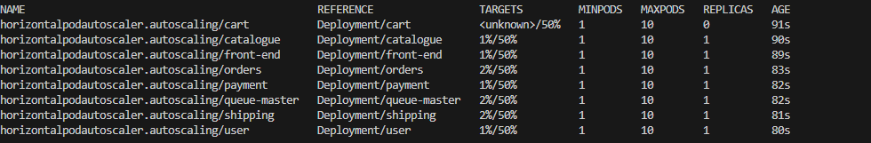

## Deployment of microservices-based application E-commerce Sock Shop on EKS using Terraform 

**Project Goals Summarized:**

This project is about deploying a microservices-based application using automated tools to
ensure quick, reliable, and secure deployment on Kubernetes. By focusing on Infrastructure as
Code, we'll create a reproducible and maintainable deployment process that leverages modern
DevOps practices and tools.

This project uses Terraform to set up an Amazon EKS (Elastic Kubernetes Service) cluster with a VPC, managed node groups, and IRSA (IAM Roles for Service Accounts) for the Amazon EBS CSI (Container Storage Interface) driver.


### Why deploy with Terraform?
While you could use the built-in AWS provisioning processes (UI, CLI, CloudFormation) for EKS clusters, Terraform provides you with several benefits:

* Unified Workflow - If you already use Terraform to deploy AWS infrastructure, you can use the same workflow to deploy both EKS clusters and applications into those clusters.

* Full Lifecycle Management - Terraform creates, updates, and deletes tracked resources without requiring you to inspect an API to identify those resources.

* Graph of Relationships - Terraform determines and observes dependencies between resources. For example, if an AWS Kubernetes cluster needs a specific VPC and subnet configurations, Terraform will not attempt to create the cluster if it fails to provision the VPC and subnet first.

### Pre-requisites
* [Terraform](https://www.terraform.io/downloads.html)
* [AWS Account](https://aws.amazon.com/)
* [awscli](http://docs.aws.amazon.com/cli/latest/userguide/installing.html)
* [kubectl v1.24.0 or newer](https://kubernetes.io/docs/tasks/tools/)

## Proposed Deployment Architecture


### Terraform Configuration
This Terraform configuration includes several modules and providers to deploy the EKS cluster and its associated resources.

### 1. AWS Provider
The AWS provider is configured to use the specified AWS region:
```
provider "aws" {
  region = var.region
}
```
### 2. VPC Module
A VPC is created using the [terraform-aws-vpc module](https://github.com/terraform-aws-modules/terraform-aws-vpc). This VPC will host the EKS cluster. The VPC module sets up the networking layer for the EKS cluster. This includes public and private subnets, NAT gateways, and routing tables.


```
module "vpc" {
  source  = "terraform-aws-modules/vpc/aws"

  name = var.vpc_name

  cidr = var.vpc_cidr
  azs  = slice(data.aws_availability_zones.available.names, 0, 3)

  private_subnets = [var.private_subnet_1_cidr, var.private_subnet_2_cidr, var.private_subnet_3_cidr]
  public_subnets  = [var.public_subnet_1_cidr, var.public_subnet_2_cidr, var.public_subnet_3_cidr]

  enable_nat_gateway   = true
  single_nat_gateway   = true
  enable_dns_hostnames = true

  public_subnet_tags = {
    "kubernetes.io/role/elb" = 1
  }

  private_subnet_tags = {
    "kubernetes.io/role/internal-elb" = 1
  }
}
```
* VPC CIDR: The CIDR block defines the IP address range for the VPC.
* Subnets: The configuration includes both public and private subnets across multiple availability zones (AZs).
    * Public subnets are used for resources that need internet access, like Load Balancers.
    * Private subnets host the Kubernetes nodes, which do not need direct internet exposure.
* NAT Gateway: A NAT Gateway allows instances in the private subnets to access the internet without exposing them to inbound internet traffic.
* Tags: The subnets are tagged for Kubernetes to automatically recognize and use them appropriately.


### 3. EKS Module
The EKS cluster is created using the [terraform-aws-eks module](https://github.com/terraform-aws-modules/terraform-aws-eks).
```
module "eks" {
  source  = "terraform-aws-modules/eks/aws"

  cluster_name    = local.cluster_name
  cluster_version = var.cluster_version

  cluster_endpoint_public_access           = true
  enable_cluster_creator_admin_permissions = true

  cluster_addons = {
    aws-ebs-csi-driver = {
      service_account_role_arn = module.irsa-ebs-csi.iam_role_arn
    }
  }

  vpc_id     = module.vpc.vpc_id
  subnet_ids = module.vpc.private_subnets

  eks_managed_node_group_defaults = {
    ami_type = var.ami_type
  }

  eks_managed_node_groups = {
    one = {
      name = "node-group-1"
      instance_types = ["t3.medium"]
      min_size     = 1
      max_size     = 3
      desired_size = 2
    }

    two = {
      name = "node-group-2"
      instance_types = ["t3.medium"]
      min_size     = 1
      max_size     = 2
      desired_size = 1
    }
  }
}
```
* Cluster Name and Version: The EKS cluster is identified by the cluster_name and runs the specified Kubernetes version.
* Cluster Endpoint: Public access to the cluster endpoint is enabled, allowing management from outside the VPC.
* Managed Node Groups: Two managed node groups are defined, each with its own set of instance types and scaling configurations.
* Add-ons: The EKS add-on for the Amazon EBS CSI driver is enabled, allowing Kubernetes to manage Amazon EBS volumes.


### 4. IAM Module for IRSA (IAM Roles for Service Accounts)
The IRSA module configures the IAM roles necessary for the EBS CSI driver.
The IAM Roles for Service Accounts (IRSA) module creates IAM roles that allow Kubernetes service accounts to assume specific AWS IAM roles. This is crucial for the Amazon EBS CSI driver, which requires permissions to manage EBS volumes.

```
data "aws_iam_policy" "ebs_csi_policy" {
  arn = "arn:aws:iam::aws:policy/service-role/AmazonEBSCSIDriverPolicy"
}

module "irsa-ebs-csi" {
  source  = ""
  
  create_role                   = true
  role_name                     = "AmazonEKSTFEBSCSIRole-${module.eks.cluster_name}"
  provider_url                  = module.eks.oidc_provider
  role_policy_arns              = [data.aws_iam_policy.ebs_csi_policy.arn]
  oidc_fully_qualified_subjects = ["system:serviceaccount:kube-system:ebs-csi-controller-sa"]
}
```
* EBS CSI Policy: The AmazonEBSCSIDriverPolicy is an AWS-managed policy granting the necessary permissions for the EBS CSI driver.
* IRSA Role: An IAM role is created that can be assumed by the Kubernetes service account used by the EBS CSI driver. The role is linked to the EKS cluster's OIDC provider.

### 5. Kubernetes Provider
The Kubernetes provider interacts with the EKS cluster once it is created. It uses the AWS IAM credentials to authenticate and manage Kubernetes resources.

```
provider "kubernetes" {
  host                   = module.eks.cluster_endpoint
  cluster_ca_certificate = base64decode(data.aws_eks_cluster.cluster.certificate_authority.0.data)
  exec {
    api_version = "client.authentication.k8s.io/v1beta1"
    command     = "aws"
    args = [
      "eks",
      "get-token",
      "--cluster-name",
      module.eks.cluster_name
    ]
  }
}
```

### S3 Backend 
```
terraform {
  backend "s3" {
    bucket = var.bucket_name
    key = var.bucket_key
    region = var.region
    encrypt = true
  }
}
```

This backend configuration creates an s3 bucket that stores the terraform statefile remotely whilst also creating a dynamodb table that locks the statefile when a user is actively working on that terraform statefile to prevent collision in the case of multiple users trying to work on the same terraform configuration at the same time.


### Deployment
 To deploy infrastructure run `Terraform init` to initialize the Terraform environment by downloading the necessary provider plugins and modules. `Terraform plan` to generate and review an execution plan to see what actions Terraform will take. `Terraform apply` to deploy the infrastructure as defined in the configuration files.
### Access Managed Cluster  
After the infrastructure is created, access the Kubernetes cluster using kubectl. 
To do this, a null resource has been defined in the terraform `main.tf` that uses the local-exec provisioner in Terraform to run the command after resources are created. 
```
resource "null_resource" "update_kubeconfig" {
  provisioner "local-exec" {
    command = "aws eks --region $(terraform output -raw region) update-kubeconfig --name $(terraform output -raw cluster_name)"
  }
}
```

*  `terraform output -raw region` : This command fetches the value of the region output from Terraform.
while `terraform output -raw cluster_name` fetches the value of the cluster_name output from Terraform.
These values are then passed to the aws eks update-kubeconfig command, which updates kubeconfig file accordingly and then our cluster can be accessed using `kubectl` commands.

* Note that *kubectl* has to be installed on host machine.

Run `kubectl get nodes` to see running nodes 

### Kubernetes manifests

There are 2 sets of manifests for deploying Sock Shop on Kubernetes: one in the [manifests directory](manifests/), and complete-demo.yaml. The complete-demo.yaml is a single file manifest
made by concatenating all the manifests from the manifests directory.
To deploy the Sock-shop, 
```
kubectl apply -f ./kubernetes/manifests
```
This command creates the `sock-shop` namespace and deploys all microservices in the manifests directory creating resources such as deployments, services, replicasets that all make up the sock-shop application, it functionality and it database.

> View the sock shop application using Ingress which routes services to the designated domain, whilst giving us the ground to connection to the domain secured.
## Steps 
### 1. Ingress Controller
For Ingress to be available for use, an ingress controller in needed to implement the ingress resource which will be created. Popular choice include Traefix, nginx. *In this case my most preferred choice is NGINX ingress controller*.
Run ` kubectl apply -f https://raw.githubusercontent.com/kubernetes/ingress-nginx/main/deploy/static/provider/aws/deploy.yaml ` to deploy the NGINX controller manifest. 


Ingress resource specifies the rules for routing traffic and uses the TLS certificate for secure connections.
Ensure that you have a domain registered and configured to point to your Kubernetes cluster's IP address( The ELB loadbalancer address of the LB that has been generated by ingress controller deployment). 

### 2. Ingress and Certificate validation for Secure Connection 
TLS certificate and private key is needed for our domain. we'd generate a self-signed certificate or obtain one from a Certificate Authority like Let's Encrypt.

1. Install and configure cert-manager in your Kubernetes cluster. Cert-manager is a Kubernetes add-on that automates the management and issuance of TLS certificates.

``` 
kubectl apply --validate=false -f https://github.com/jetstack/cert-manager/releases/download/v1.10.0/cert-manager.yaml 
```
2. Declaratively define a cluster Issuer which uses Let's Encrypt to verify that you control the domain 
```
kubectl apply -f ./kubernete/ingress/issuer.yaml
```

3. Next up, create a Certificate resource in Kubernetes, specifying the domain and subdomain name and the ingress resource that will be using the certificate. Cert-Manager stores the issued certificate in the Kubernetes Secret specified in the Certificate resource ( in this case sockshop-tls)
``` 
kubectl apply -f ./kubernetes/ingress/cerificate.yaml
```

4. Configure your Ingress resource to use the certificate. Add the `cert-manager.io/cluster-issuer` annotation to your Ingress resource, specifying the name of the ClusterIssuer or Issuer resource that was previously created.


5. Ingress class: 
    In order for the ingress resource to correctly route to our designated domain, we define an `IngressClass` and referenced it in the Ingress resource.

6. Apply the changes to your Kubernetes cluster, and cert-manager will automatically request and manage the certificate for your domain.

Run ` kubectl apply -f ./kubernetes/ingress/ingress.yaml `
#### Here's the Secured sock-shop application 

#### Here's the certificate


## Monitoring 
All monitoring is performed by prometheus. All services expose a `/metrics` endpoint. All services have a Prometheus Histogram called `request_duration_seconds`, which is automatically appended to create the metrics `_count`, `_sum` and `_bucket`.


First create the monitoring namespace using the `00-monitoring-ns.yaml` file:

`$ kubectl create -f 00-monitoring-ns.yaml`

### Prometheus
Prometheus scrapes metrics from the nodes, pods, and other Kubernetes objects via the node-exporter in this project. These metrics are stored in Prometheus’s time-series database.

To deploy simply apply all the prometheus manifests in any order:

`kubectl apply $(ls *-prometheus-*.yaml | awk ' { print " -f " $1 } ')`

The prometheus server will be exposed on Nodeport `31090`.

This creates the prometheus services, pod and deployment, alert-rules.To access the prometheus dashboard; *In this case, port-forwarding would be used to access the dashboard* 

`kubectl port-forward service/prometheus <host-port>:9090`
**Here's the prometheus dashboard**


### Grafana
Grafana queries Prometheus for the stored metrics.
First apply the grafana manifests:

`kubectl apply $(ls *-grafana-*.yaml | awk ' { print " -f " $1 }'  | grep -v grafana-import)`

Once the grafana pod is in the Running state apply the `23-grafana-import-dash-batch.yaml` manifest to import the Dashboards:

`kubectl apply -f 23-grafana-import-dash-batch.yaml`
Grafana visualizes the metrics on dashboards, which can show real-time data and historical trends.
Also port forwarding would be used to access the grafana dashboard *in this case*
`kubectl port-forward service/grafana <host-port>:80`

Here's some metrics been displayed in the Grafana dashboard 
1. List of resources been managed and monitored that includes Kubernetes node resources, pod resources, Sock-Shop Analytics, Sock-Shop Performance and Sock-shop resources 


1. Kubernetes Node Resources Dashboard


1. Sock-shop Performance


## Alerting 
Prometheus can be configured to send alerts when specific conditions in your Kubernetes cluster are met, such as high CPU usage, memory exhaustion, or pod failures. The component responsible for handling these alerts is Alertmanager. We will integrate Alertmanager with Slack to send notifications directly to a Slack channel, allowing for notice and quick response to issues.


In order for the alerting component to work, a Kubernetes secret called "slack-hook-url" needs to be created. The content of the secret needs to be the Slack Hook API url.

### Steps
1. Create a Secret that contains the slack incoming webhook url. 
    > NOTE: You need to base64 encode your Slack Webhook URL because Kubernetes secrets store data in base64 format.

    Run `kubectl apply -f slack-hook-url-secret.yaml` to create Kubernetes secret.


    

1. The next step is to create other resources (Alertmanager-configMap.yaml, Alertmanager-dep.yaml,Alertmanager-svc.yaml) using `kubectl apply -f <file-name>`. 
**IN MY CASE** The result resulted into the alert-manager pod crashing in a 'CrashLoopBackOff' error. 
Using kubectl logs <pod-name>, I realized what was wrong *(after few days of debugging,lol)*, the sed command `sed -i -e s,API_URL_SECRET,"$SLACK_HOOK_URL",g /etc/alertmanager/config.yml` in the `configure_secret.sh` script defined in the configMap that was created failed because it cannot create a temporary file to modify '/etc/alertmanager/config.yml'. This likely happens because the file system where the ConfigMap is mounted is read-only.

Here's the command and the error 
```
$ kubectl logs pod/alertmanager-755964986c-5hrf9
sed: can't create temp file '/etc/alertmanager/config.ymlvFbQOc': Read-only file system
Configuring Slack hook url.
alertmanager: error: unknown short flag '-c', try --help
```

> Here's how I solved it

Since configMaps are mounted as read-only by default, so modifying files in place with `sed` will not work. Instead I used an **init container** to copy the ConfigMap to a writable directory, modify it by replacing the placeholder `API_URL_SECRET` with the value of the environment variable `SLACK_HOOK_URL` in the `/alertmanager/config.yml` file, and then used it in the main container in the alert-manager deployment file.
While in the manifests-alerting directory, 
Run `kubectl apply -f alertmanager-dep.yaml` 

Upon successful deployment of alert manager, restart the prometheus pod to see the alerting rules in action having already been created alerting rules in the 'manifest-monitoring' directory earlier, some of these alerting rules are triggered based on high CPU usage, high memory usage which send alerts to prometheus and Slack.

Here are alerts sent to Prometheus
    

Here are alerts sent to Slack 
    

## Autoscaling with HPA
The Horizontal Pod Autoscaler automatically scales the number of pod replicas in a deployment, replica set, or stateful set based on observed CPU utilization
To deploy the Horizontal Pod Autoscaler, 
go to the 'autoscaling' directory
    
    
Run `kubectl apply -f .`




## CI/CD With Github Actions
This repository also contains a CI/CD pipeline powered by GitHub Actions. The pipeline is designed to automate the provisioning and management of AWS infrastructure, as well as the deployment and management of Kubernetes resources using Amazon EKS .

The CI/CD pipeline is defined in the ci-cd-pipeline.yml file under the .github/workflows directory. The workflow includes the following steps:

### Checkout Code: Retrieves the latest code from the repository.
1. Install Kubectl
  

1. Set Up AWS Credentials: Configures AWS credentials using GitHub Secrets.

1. Install Terraform: Installs the specified version of Terraform.

1. Terraform Init: Initializes Terraform and sets up the backend configuration.
    
1. Terraform Plan: Generates an execution plan for the Terraform configuration.

1. Terraform Apply: Applies the Terraform plan to create or update infrastructure.

1. Configure kubectl: Sets up kubectl to interact with the EKS cluster using the provided Kubeconfig.
    

1. Deploy Microservice Application: Deploys the kubernetes component that makes up the whole Microservice application

      


### Environment Variables
The following environment variables are required:
AWS_REGION: AWS region
AWS_ACCESS_KEY_ID: AWS Access Key ID.
AWS_SECRET_ACCESS_KEY: AWS Secret Access Key.
KUBE_CONFIG_DATA: Base64-encoded Kubeconfig data for accessing the EKS cluster.


### AWS Credentials Setup
To set up AWS credentials, store your AWS Access Key and Secret Key as GitHub Secrets:

Navigate to your GitHub repository.
Go to Settings > Secrets > New repository secret.
Add the following secrets:
AWS_ACCESS_KEY_ID
AWS_SECRET_ACCESS_KEY

### Kubernetes Configuration
The KUBE_CONFIG_DATA secret is required for configuring kubectl in the pipeline. Follow these steps to generate and store the Kubeconfig:


### Running the Pipeline
Once the pipeline is configured, it will automatically trigger on pushes to the master branch. 

## The 'Destroy' Workflow
After deployment of the sock shop microservices through this well constructed pipeline, resources are been created on the AWS account which warrant a need to delete and cleanup resources after use. 

To solve this, I have created a new workflow called 'destroy.yaml' which cleans up which the aid of using the backend which in this case is S3 which stores the terraform statefile and can there compare the state of the configuration with the actual resource that exist in AWS account. 

### This pipeline follow quite a simple workflow
Starting a New Workflow:

The first step is to initialize Terraform using terraform init.
During initialization, Terraform connects to the S3 backend and downloads the existing state file. This gives Terraform a full understanding of what resources have been created, even if they were created in a different workflow.
#### Running terraform destroy:

Now, when terraform destroy is ran, Terraform compares the state file (downloaded from S3) with the current state of your infrastructure and identifies which resources it needs to destroy.
Since the state file reflects the resources managed by Terraform, it knows exactly what to delete.

  

## License
This project is licensed under the MIT License. 